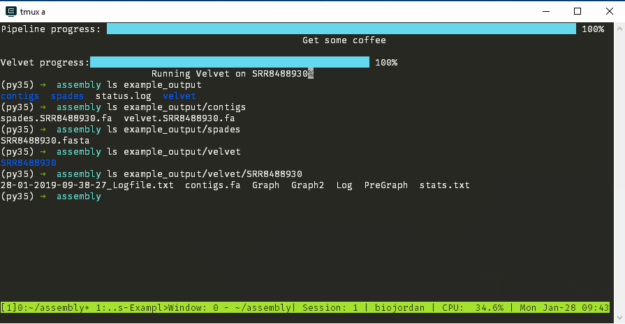

# Computational Genomics Genome Assembly Pipeline

## SUMMARY

This pipeline is designed to assemble genomes from Illumina reads using a number of assembly programs and techniques (*de novo* and reference guided).  It also supports the creation of a "meta" assembly, which is a consensus sequence based on assemblies from SPAdes, Velvet and ABYSS.

## INSTALL

Below are directions for installing this pipeline, assuming you have a Anaconda available on your PATH.  If you do not use Anaconda, please make sure that the below programs are available on your PATH.

- [SPAdes](http://cab.spbu.ru/software/spades/): De Bruijn graph assembler
- [Velvet](https://www.ebi.ac.uk/~zerbino/velvet/): Sequence assembler for very short reads
- [VelvetOptimizer](http://www.vicbioinformatics.com/software.velvetoptimiser.shtml): Magically better Velvet assembly
- [ABYSS](http://www.bcgsc.ca/platform/bioinfo/software/abyss): Assembly By Short Sequences
- [QUAST](http://quast.sourceforge.net/quast): Assembly Quality Control
- [sratoolkit](https://github.com/ncbi/sra-tools): Tools for working with the SRA


```bash
conda create -c bioconda --name Assembly python=3.5 perl-velvetoptimiser spades abyss quast sra-tools -y
source activate Assembly
cpan Term::Report Async
git clone git@github.gatech.edu:compgenomics2019/Instructors-ExampleRepo.git
export PATH=$PWD/Instructors-ExampleRepo:$PATH
# Optional
# echo "export $PATH" >> ~/.bashrc
# cp $PWD/Instructors-ExampleRepo/assembly_pipeline.pl
assembly_pipeline.pl -h

# USAGE
#   assembly_pipeline.pl -in <indir> -o <outdir> -R <reffile> --steps <steps,to,run>

# DESCRIPTION
#         Spades pipeline

# OPTIONS
#         -in     dir             Directory with fq.gz
#         -o      dir             output folder
#         -R      file    Reference genome file
#         --steps list    Comma separated list of steps to run
#                                         Valid steps: abyss, velvet, spades
# EXAMPLES
#   assembly_pipeline.pl -in ./scratch/reads -o ./scratch/assemblies --steps velvet,abyss,spades -R ./reference/genomic.fna.gz
#   assembly_pipeline.pl -h

# EXIT STATUS
#   0     Successful completion
#   >0    An error occurred

```


## GETTING STARTED

### Preparing your data

```bash
fastq-dump --split-files SRR8488930 -O example_data
# Read 797234 spots for SRR8488930
# Written 797234 spots for SRR8488930
ls example_data
# SRR8488930_1.fastq  SRR8488930_2.fastq
for i in example_data/*; do gzip $i; done
ls example_data
# SRR8488930_1.fastq.gz  SRR8488930_2.fastq.gz
```


### Running `assembly_pipeline.pl`

`assembly_pipeline.pl` is very easy to run, it takes three required arguments.

1. `-in`: A folder containing paired end reads to assemble in read1_1.fq.gz / read2_2/.fq.gz format
2. `-o`: Output folder for assemblies
3. `--steps`: Which steps of the pipeline to run.  Minimally, users must select from `spades`,`velvet`, or `abyss`

```bash
assembly_pipeline.pl -in $PWD/example_data -o $PWD/example_output --steps spades,velvet
ls  example_output/{,contigs,spades,velvet,velvet/SRR8488930}
# example_output/:
# contigs  spades  status.log  velvet
#
# example_output/contigs:
# spades.SRR8488930.fa  velvet.SRR8488930.fa
#
# example_output/spades:
# data  example_data  SRR8488930
#
# example_output/velvet:
# SRR8488930
#
# example_output/velvet/SRR8488930
# 28-01-2019-08-29-37_Logfile.txt  contigs.fa  Graph  Graph2  Log  PreGraph  stats.txt


```




## CITATION

Chande, AT. 2016. Genome Assembly Pipeline. https://github.gatech.edu/compgenomics2019/Instructors-ExampleRepo